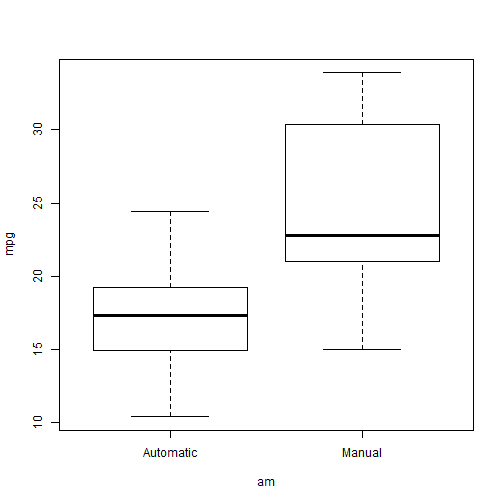

Which Statistical Test Should I use?
========================================================
author: Hank
date: 1/29/2016
transition: rotate
font-family: 'Helvetica'

Problem
========================================================

- There are so many different types of data and parameters for data that it is not always easy to make sense of the data
- Statistics is what allows us to determine if our valuable data is meaningful or not.
- However, which statistical test should you use to analyze your data? It is not a test fits all deal?
- Factors such as the type of variables in your data, the way the data is collected, the number of parameters and groups, and normality of the data, all factor into determining what type of analysis you should use.

Stat test App
========================================================

- Luckily, we now have a simple app that automatically determines the appropriate statistical test for you to use.
- Simply input the relevant parameters, including independent variable type, dependent variable type, paired, normal, and number of sample groups that correspond to your data and click submit!

- We even include 2 examples with sample data that show linear regression and a t-test from sample datasets. We also show what are the relevant test statistics and p-values.
t-test example
========================================================
- <small> Our mtcars data requires a t-test is because our dependent var "mpg" is numeric, while the independent var "am" is categorical. The data is normal and unpaired. </small> 


```
[1] "p = 0.000285 , t stat = -4.11"
```




Linear regression and Pearson's r example
========================================================
- <small> When your variables are numeric, without defined groups, we use linear regression and pearson's r to assess the data. </small> 


```
[1] "r = 0.81 , intercept: 8.3 , slope: 0.17"
```


 
 
